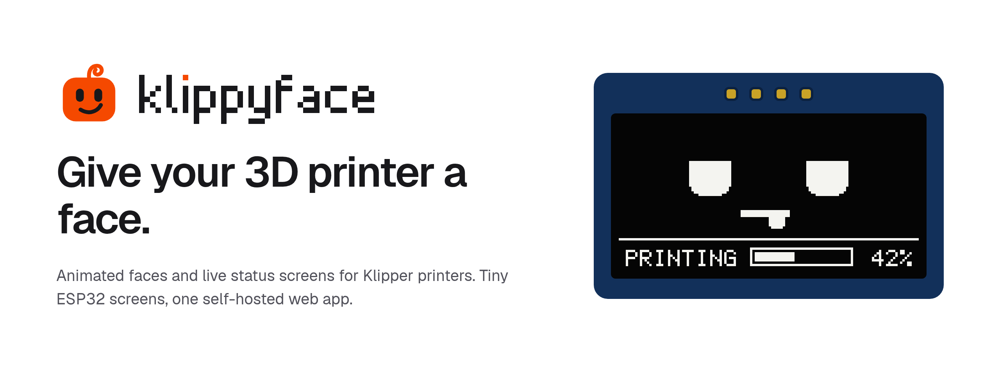

<p align="center">
  <picture>
    <source media="(prefers-color-scheme: dark)" srcset="docs/assets/banner-dark.png">
    
  </picture>
</p>

A multi-node ESP32 display system driven by live Moonraker/Klipper printer data. Replace your static 3D printer status display with animated faces, progress bars, temperature readouts, and custom notifications — all configurable from a web UI.

> ⚠️ Work in Progress  
>
> This project is in a very early stage and is not production-ready yet.  
> Contributions, suggestions, and architectural discussions are welcome while the project is taking shape.


## How It Works

```
┌────────────────┐    WebSocket     ┌──────────────────┐  WS (+HTTP)  ┌──────────────────────┐
│   Moonraker    │ ←───────────────→│  ESP32 (Node)    │ ←───────────→│  Companion Server    │
│  (Klipper API) │                  │  SH1106 OLED(s)  │   heartbeat  │  (.NET 10 + SQLite)  │
└────────────────┘                  └──────────────────┘   hello      └──────────────────────┘
                                                    config_push               │
                                                                        ┌─────┴──────┐
                                                                        │  Web UI    │
                                                                        │ (Browser)  │
                                                                        └────────────┘
```

1. **ESP32** boots, connects to Companion Server via WebSocket at `/api/ws/node/{mac}`, sends `hello` with its `config_version`
2. **Companion Server** checks version — if stale, pushes `refresh_config`; if up-to-date, responds `config_status { up_to_date: true }` — no unnecessary redraw
3. **Moonraker WebSocket** streams real-time printer state to the ESP32 for display triggering
4. **Display engine** selects the right animation group based on printer state: `printing`, `idle`, `paused`, `error`, `complete`
5. **Klipper macros** can push commands directly: `DISPLAY_FACE GROUP=celebration SET=party`
6. **Web UI** provides full visual management — node registry, sprite pixel editor, animation preview, preset scheduling
7. **Admin edits** (displays, groups, animations) automatically bump `LastConfigVersion` and push `refresh_config` to all connected nodes in real-time

## Quick Start

### Firmware (ESP32)

```bash
# Build with mock mode (no printer needed)
pio run -e esp32dev-mock

# Flash to device
pio run -e esp32dev -t upload

# View serial console
pio device monitor
```

### Companion Server

```bash
cd server
dotnet run
# → http://localhost:5000
```

### Web UI (Development)

```bash
cd ui
npm install
npm run dev
# → http://localhost:5173 (proxies /api to :5000)
```

### Web UI (Production Build)

```bash
cd ui
npm run build
# → outputs to server/wwwroot/, served by dotnet run
```

## Features

| Feature | Status |
|---------|--------|
| ESP32 firmware with FreeRTOS multitasking | ✅ Done |
| Display drivers — SH1106 (I²C OLED), HX8347D (8-bit parallel TFT) | ✅ Done — hardware-verified, see [`docs/hardware/`](docs/hardware/). ST7789 planned ([#21](https://github.com/luke-kearney/klippyface/issues/21)) |
| ESP32-S3 support | ⬜ Planned ([#20](https://github.com/luke-kearney/klippyface/issues/20)) |
| Real-time Moonraker WebSocket integration | ⚠️ Partial — print state triggers, live progress/nozzle/bed values, connection monitoring, screen sleep. First extruder only ([#22](https://github.com/luke-kearney/klippyface/issues/22)) |
| Configurable animations (Groups → Sets → Frames → Elements) | ✅ Done — sprite, text and live data elements, per-frame durations, looping. Richer progress/temperature rendering planned ([#3](https://github.com/luke-kearney/klippyface/issues/3), [#4](https://github.com/luke-kearney/klippyface/issues/4)) |
| Starter faces for every printer state | ✅ Done — imported on first run, or from the Groups page |
| Klipper GCODE macro integration | ⚠️ Partial — `DISPLAY_FACE` switches group/set; alerts and per-node targeting not yet |
| Presets (night mode, schedules) | ⚠️ Partial — editable in the Web UI, not yet applied to nodes ([#2](https://github.com/luke-kearney/klippyface/issues/2)) |
| .NET 10 companion server with SQLite | ✅ Done — full CRUD API + per-node config export |
| WebSocket channel — node online tracking, heartbeat, config push | ✅ Done — persistent WS at `/api/ws/node/{mac}`, hello/heartbeat/refresh protocol |
| Web UI — nodes, displays, state triggers, groups, sets, sprites, presets | ✅ Done — React + TypeScript, edits push to nodes live |
| Web UI — set editor | ✅ Done — drag-to-place elements, filmstrip, onion skin, playback |
| Web UI — pixel sprite editor | ✅ Done — pencil/line/rect/fill/text tools, brush sizes, mirror drawing, undo, image import |
| Web UI — live previews matching the device | ✅ Done |
| Captive portal first-boot setup | ✅ Done |
| Release builds (firmware `.bin`, self-contained server) | ✅ Done — [GitHub Releases](https://github.com/luke-kearney/klippyface/releases) |
| Browser-based firmware flasher | ⬜ Planned ([#24](https://github.com/luke-kearney/klippyface/issues/24)) |
| Multi-node support | ⚠️ Done, untested |

See [open GitHub Issues](https://github.com/luke-kearney/klippyface/issues) for upcoming work and current priorities.

## Architecture

The system has three major components:

| Component | Stack | Purpose |
|-----------|-------|---------|
| **ESP32 firmware** | PlatformIO, Arduino, FreeRTOS | Drives displays, connects to Moonraker, runs animations |
| **Companion server** | .NET 10, EF Core, SQLite | REST API, node config, sprite/group library |
| **Web UI** | React + TypeScript + Vite | Full visual editor for all content |

Hardware compatibility docs are in [`docs/hardware/`](docs/hardware/):
- [Display drivers](docs/hardware/display.md) — confirmed displays, wiring, pinouts, known issues
- [MCU / dev boards](docs/hardware/mcu.md) — tested ESP32 variants, strapping pins, limitations

Detailed architecture docs are in [`docs/architecture/`](docs/architecture/):
- [System overview](docs/architecture/overview.md) — diagrams, data flow, core concepts
- [Firmware](docs/architecture/firmware.md) — FreeRTOS tasks, display driver, animation engine, sprites
- [Server](docs/architecture/server.md) — .NET structure, models, services, Docker
- [Frontend](docs/architecture/frontend.md) — Vite, component tree, routing, preview canvas
- [Data model](docs/architecture/data-model.md) — SQLite schema, entity relationships

### Project Structure

```
klippyface/
├── platformio.ini           # ESP32 build config
├── CONTRIBUTING.md          # Coding conventions, PR workflow, checklist
├── AGENTS.md                # AI agent bootstrap instructions
├── docs/                    # Reference documentation
│   ├── architecture/        # System architecture by domain
│   ├── hardware/            # Confirmed displays, pinouts, bus configs
│   ├── reference/           # API reference, GCODE macros
│   └── decisions/           # Design decision log (ADRs)
├── src/                     # ESP32 firmware (C++)
│   ├── main.cpp             # FreeRTOS task orchestration
│   ├── display/             # Display drivers, renderer, sprite engine
│   ├── engine/              # Animation engine, config, data bindings
│   ├── comms/               # Moonraker WebSocket, config fetcher, GCODE handler
│   ├── wifi/                # WiFi manager, captive portal
│   └── config/              # NVS settings storage
├── server/                  # .NET 10 companion server
├── ui/                      # Web UI source (Vite project)
├── docker/
│   └── Dockerfile
└── scripts/
    └── xbm-convert.py
```

## Moonraker Connection

The ESP32 connects to [Moonraker](https://github.com/Arksine/moonraker) via WebSocket at `ws://{host}:{port}/websocket` and subscribes to real-time printer state updates.

### Connection Lifecycle

1. **WiFi connects** → `moonrakerTask` waits for WiFi via event group
2. **WebSocket connects** → sends `printer.objects.subscribe` JSON-RPC
3. **State updates arrive** → MoonrakerClient parses JSON, publishes `StateEvent` to FreeRTOS queue
4. **DisplayManager.onStateChange()** → fans out to all engines → group switch
5. **Disconnect** → auto-reconnect with backoff, re-subscribes on reconnect
6. **Keep-alive** → WebSocket PING every 30s (handled by WebSockets library)

### Connection Status Handling

Three dedicated display groups for connection states:

| Group | Content | Trigger |
|-------|---------|---------|
| `wifi_offline` | "WiFi Offline" + "Check network" | `wifi:disconnected` |
| `moonraker_offline` | "Moonraker Down" + "Reconnecting..." | `moonraker:disconnected` |
| `screen_sleep` | Blank (OLED powers off) | 30s idle timeout |

### Mock Mode (No Printer Required)

For testing without a physical Moonraker instance, build with `esp32dev-mock`. It simulates printer state transitions on a timer: **idle (5s) → printing (15s, rising progress) → complete (3s) → idle → ...**

### Serial Log Output

```
[BOOT] Klippyface Display System v0.2
[WIFI] Connecting to MyNetwork...
[WIFI] Connected, IP: 192.168.2.100
[MOONRAKER] Connecting to ws://192.168.2.21:7125/websocket
[MOONRAKER] Connected
[MOONRAKER] Subscribed to printer objects
[MOONRAKER] State: printing
[MAIN] State: state:printing (progress: 45.2%)
[DISPLAY] Engine triggered: state:printing → printing_faces
[SRVCLIENT] Connecting to ws://192.168.1.57:5000/api/ws/node/AA:BB:CC:DD:EE:01
[SRVCLIENT] Connected to server
[SRVCLIENT] Sent hello (config_version: 1)
[SRVCLIENT] Config is up to date — no fetch needed
```

## Hardware Compatibility

See [`docs/hardware/`](docs/hardware/) for wiring diagrams, bus configs, and
known issues for every display driver and MCU that has been tested with Klippyface.

| Category | Index | Verified |
|----------|-------|----------|
| Display drivers | [`docs/hardware/display.md`](docs/hardware/display.md) | SH1106 (I2C OLED), HX8347D (Parallel 8 TFT) |
| MCU / dev boards | [`docs/hardware/mcu.md`](docs/hardware/mcu.md) | ESP-WROOM-32 (ESP32 DevKit V1) |

If you've tested a display or board not listed here, open a PR or issue with
your wiring details and we'll add it.

## Contributing

See [`CONTRIBUTING.md`](CONTRIBUTING.md) for coding conventions, git style, and the PR review checklist. All work is tracked in [GitHub Issues](https://github.com/luke-kearney/klippyface/issues) with labels for area, priority, and type.

## License

MIT — see [LICENSE](LICENSE)
