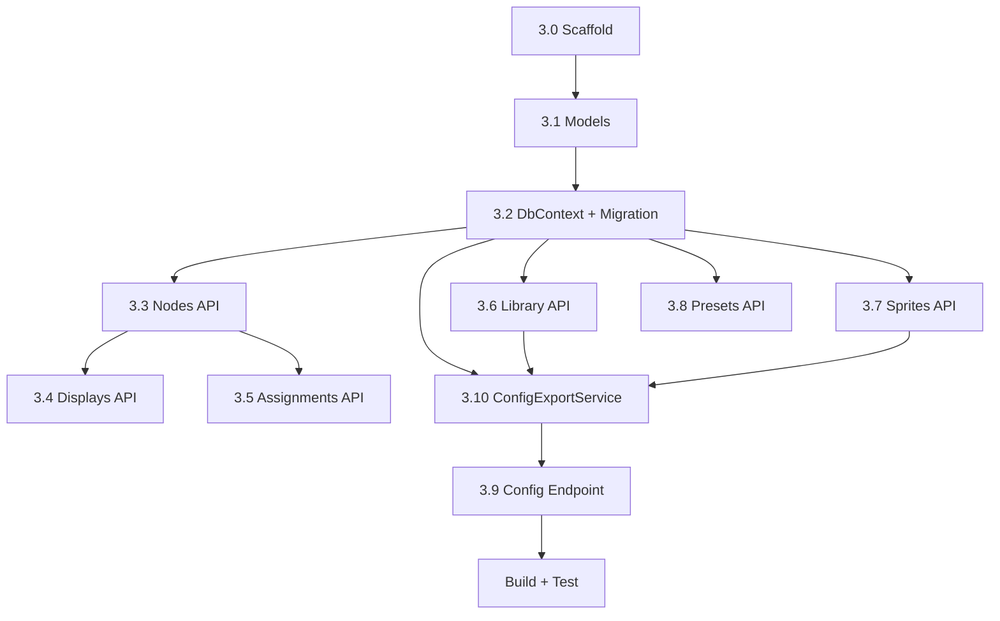

# Phase 3: Companion Server — Implementation Notes

**Created:** 2026-05-11
**Target:** .NET 10 Minimal API + EF Core + SQLite

---

## Execution Plan

### Overview
Build a .NET 10 Minimal API with EF Core + SQLite, implementing full CRUD for all entities and a config export endpoint that the ESP32 calls at boot (Phase 4).

### Prerequisites
- .NET 10 SDK installed
- `dotnet ef` tool installed (`dotnet tool install --global dotnet-ef`)

---

### Task 3.0 — Scaffold .NET Project

**Files:**
- `server/Klippyface.Server.csproj`
- `server/Program.cs`

**csproj packages:**
- `Microsoft.EntityFrameworkCore.Sqlite`
- `Microsoft.EntityFrameworkCore.Design`

**Program.cs bootstrap:**
- Builder setup
- `AddDbContext<KlippyfaceDbContext>` with SQLite (`Data Source=klippyface.db`)
- CORS allow-all (dev)
- Static files from `wwwroot/`
- Map all API endpoint groups
- Auto-apply migrations at startup

---

### Task 3.1 — EF Models (`server/Models/*.cs`)

10 model files:

| File | Entity | Key Notes |
|------|--------|-----------|
| `Node.cs` | Node | `string Id` (Guid), unique `MacAddress`, `FriendlyName`, `Description`, timestamps |
| `NodeDisplay.cs` | NodeDisplay | FK→Node, `DriverType`, `BusType`, `BusConfig` (JSON string), `Width/Height/Rotation`, `SortOrder` |
| `Assignment.cs` | Assignment | FK→Node + FK→NodeDisplay, `DefaultGroup`, `TriggersJson`, nullable `ActivePreset` |
| `Group.cs` | Group | `string Id` (natural key), `Label`, `SortOrder`, timestamps |
| `Set.cs` | Set | FK→Group, `Label`, `SortOrder`, `LoopCount`, `FrameTime` |
| `Frame.cs` | Frame | FK→Set, `SortOrder`, `DurationMs`, `BgColor` |
| `FrameElement.cs` | FrameElement | FK→Frame, `SortOrder`, `Type`, `Value`, `Label`, `Color`, `X/Y` |
| `Sprite.cs` | Sprite | `string Id` (natural key), `Label`, `Width/Height`, `DataBase64` |
| `Preset.cs` | Preset | `string Id` (natural key), `Label`, `ConditionsJson`, `OverridesJson` |
| `NodePreset.cs` | NodePreset | Composite PK (NodeId, PresetId), `Enabled` |

---

### Task 3.2 — DbContext (`server/Data/AppDbContext.cs`)

- `KlippyfaceDbContext` with `DbSet<>` for all 10 entities
- `OnModelCreating`: unique index on `Node.MacAddress`, composite PK on `NodePreset`, cascade deletes
- Seed data matching the PLAN.md JSON contract example
- Auto-migrate at startup
- Run `dotnet ef migrations add InitialCreate` after models + DbContext are done

---

### Task 3.3 — Nodes API (`server/Api/NodesApi.cs`)

| Method | Route | Description |
|--------|-------|-------------|
| GET | `/api/nodes` | List all nodes |
| POST | `/api/nodes` | Register new node |
| GET | `/api/nodes/{id}` | Get node + displays + assignments |
| PUT | `/api/nodes/{id}` | Update node |
| DELETE | `/api/nodes/{id}` | Delete node (cascade) |

---

### Task 3.4 — Displays API (within NodesApi.cs or separate)

| Method | Route | Description |
|--------|-------|-------------|
| GET | `/api/nodes/{id}/displays` | List displays on node |
| POST | `/api/nodes/{id}/displays` | Add display |
| PUT | `/api/nodes/{id}/displays/{did}` | Update display |
| DELETE | `/api/nodes/{id}/displays/{did}` | Remove display |

---

### Task 3.5 — Assignments API (within NodesApi.cs or separate)

| Method | Route | Description |
|--------|-------|-------------|
| PUT | `/api/nodes/{id}/displays/{did}/assignment` | Upsert assignment |
| GET | `/api/nodes/{id}/displays/{did}/assignment` | Get assignment for display |

---

### Task 3.6 — Library API (`server/Api/LibraryApi.cs`)

Full CRUD for groups/sets/frames/elements hierarchy:

| Method | Route | Description |
|--------|-------|-------------|
| GET | `/api/groups` | List all groups |
| POST | `/api/groups` | Create group |
| GET | `/api/groups/{id}` | Get group with sets |
| PUT | `/api/groups/{id}` | Update group |
| DELETE | `/api/groups/{id}` | Delete group (cascade) |
| GET | `/api/groups/{gid}/sets` | List sets |
| POST | `/api/groups/{gid}/sets` | Create set |
| PUT | `/api/sets/{sid}` | Update set |
| DELETE | `/api/sets/{sid}` | Delete set (cascade) |
| GET | `/api/sets/{sid}/frames` | List frames |
| POST | `/api/sets/{sid}/frames` | Create frame |
| PUT | `/api/frames/{fid}` | Update frame |
| DELETE | `/api/frames/{fid}` | Delete frame |
| PUT | `/api/sets/{sid}/frames/reorder` | Reorder frames |
| GET | `/api/frames/{fid}/elements` | List elements |
| POST | `/api/frames/{fid}/elements` | Create element |
| PUT | `/api/elements/{eid}` | Update element |
| DELETE | `/api/elements/{eid}` | Delete element |
| PUT | `/api/frames/{fid}/elements/reorder` | Reorder elements |

---

### Task 3.7 — Sprites API (`server/Api/SpritesApi.cs`)

| Method | Route | Description |
|--------|-------|-------------|
| GET | `/api/sprites` | List (without data_base64) |
| POST | `/api/sprites` | Create (JSON with base64 data) |
| GET | `/api/sprites/{id}` | Get with data |
| PUT | `/api/sprites/{id}` | Update |
| DELETE | `/api/sprites/{id}` | Delete |

PNG upload → native format conversion is deferred (Phase 3 covers JSON+base64 path).

---

### Task 3.8 — Presets API (`server/Api/PresetsApi.cs`)

| Method | Route | Description |
|--------|-------|-------------|
| GET | `/api/presets` | List all |
| POST | `/api/presets` | Create |
| GET | `/api/presets/{id}` | Get |
| PUT | `/api/presets/{id}` | Update |
| DELETE | `/api/presets/{id}` | Delete |

---

### Task 3.9 — Config Export Endpoint (`server/Api/ConfigApi.cs`)

- `GET /api/config/node?mac={mac}` — delegates to ConfigExportService, returns 404 if not found
- `GET /api/config/library` — full library dump for web UI

---

### Task 3.10 — ConfigExportService (`server/Services/ConfigExportService.cs`)

Walks EF entities to construct the per-node JSON contract (PLAN.md lines 238–371):
1. Load node by MAC (with displays + assignments)
2. Collect group IDs from triggers + default groups
3. Load those groups (with sets → frames → elements)
4. Collect sprite IDs from FrameElements with type=="sprite"
5. Load those sprites
6. Build DTO matching JSON contract shape
7. Return

---

### Build & Test Verification

```bash
dotnet build server/
dotnet run --project server/
curl http://localhost:5000/api/nodes
curl http://localhost:5000/api/config/node?mac=AA:BB:CC:DD:EE:01
```

### Execution Order


